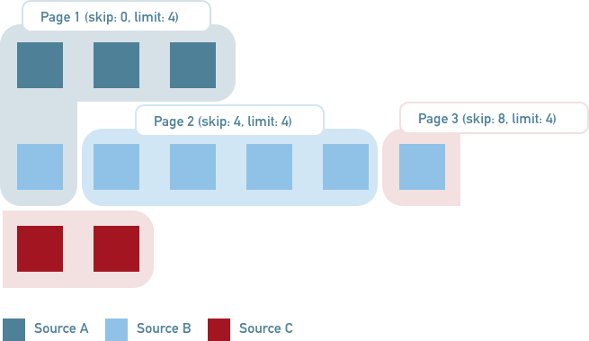

# Paginate over sources


[](https://coveralls.io/github/augustindlt/paginate-over-sources?branch=master)
[](https://www.npmjs.com/package/paginate-over-sources)

It can sometimes be tricky to make a proper pagination especially with data coming from multiple sources.

Thanks to this library, you'll achieve this in no time.

This library can be used for infinite scroll purposes.

### What you can do with `paginate-over-sources` :



```javascript
const sourceA = {
  count: () => Promise.resolve(3),
  items: ({ limit, skip }) => getItemsSourceA({ limit, skip }),
};

const sourceB = {
  count: () => Promise.resolve(6),
  items: ({ limit, skip }) => getItemsSourceB({ limit, skip }),
};

const sourceC = {
  count: () => Promise.resolve(2),
  items: ({ limit, skip }) => getItemsSourceC({ limit, skip }),
};

const paginated = await paginate({
  sources: [sourceA, sourceB, sourceC],
  skip: 0,
  limit: 4,
}); // => { items: [...], currentPage: 1, totalPages: 3, totalItems: 11 }
```

## Documentation

### Installation

`yarn add paginate-over-sources`

### Usage

```typescript
paginate<TItem>({
  sources: {
    count: () => Promise<number>,
    items: (p: { limit: number; skip: number }) => Promise<TItem[]>;
  }[],
  skip: number
  limit: number
})
```

`sources`: This parameter takes an array of sources.

`source`:

- `count`: This parameter takes a function which must return the items count of the source.
- `items`: This parameter takes a function which must return the items of the source.

`skip` : This parameter takes a number that represents the amount of items to skip.

`limit` : This parameter takes a number that represents the amount of items to get.
